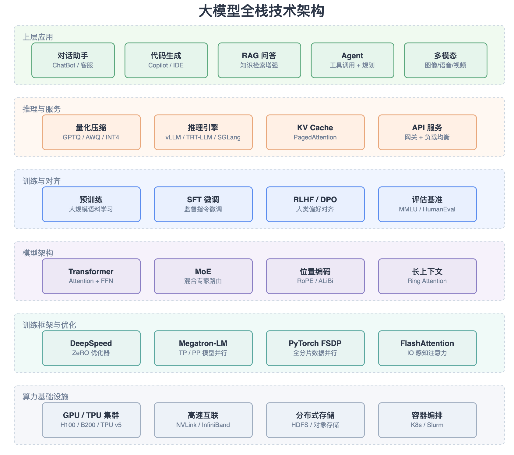
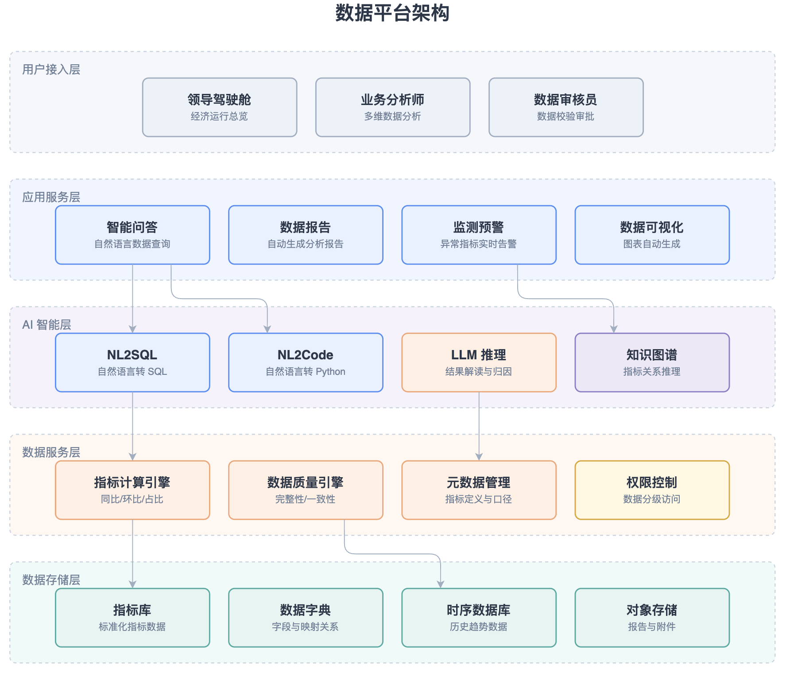
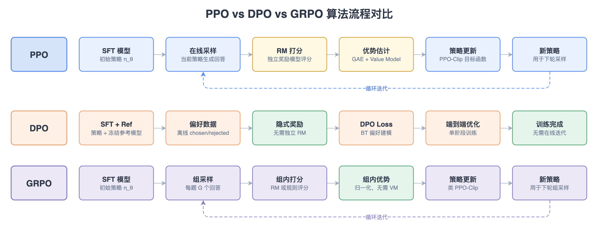
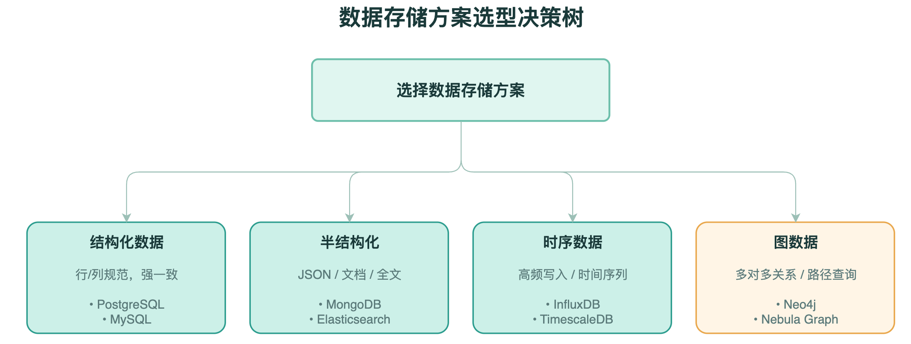
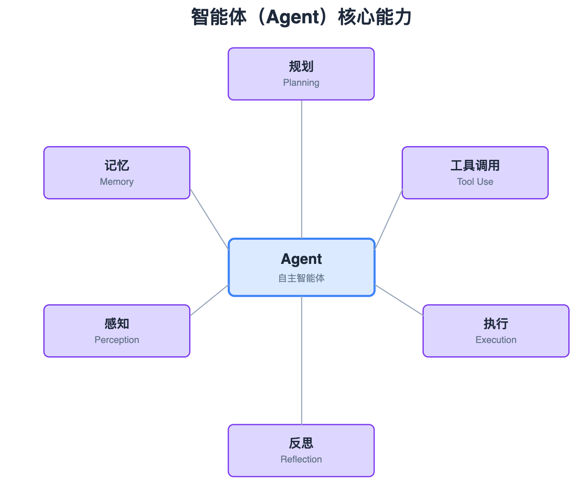
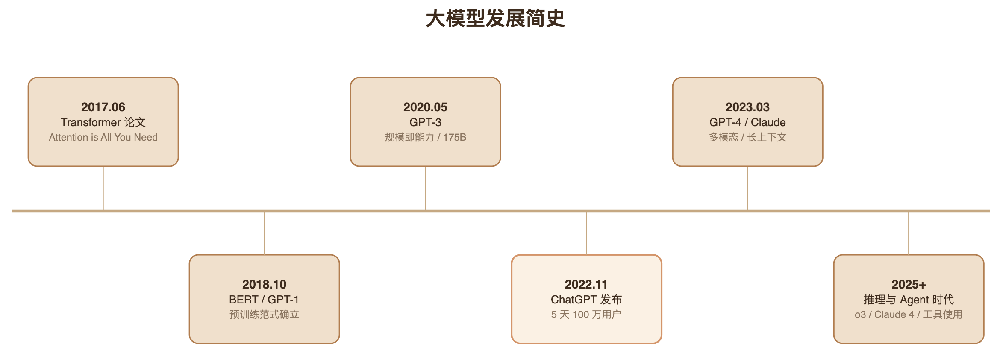

# FlowForge

> A Claude Code skill that turns natural language into professional draw.io diagrams — flowcharts, architecture diagrams, comparisons, and more.

[](LICENSE)
[](CHANGELOG.md)
[](https://code.claude.com)

**English** | [中文](README.zh-CN.md)

<p align="center">
  
</p>

---

## What is FlowForge?

FlowForge is a [Claude Code](https://code.claude.com) skill that generates professional `.drawio` diagrams from natural language descriptions. Just describe what you want — a CI/CD pipeline, a system architecture, an algorithm comparison — and FlowForge produces a clean, well-laid-out draw.io XML file ready to open in [draw.io desktop](https://www.drawio.com/) or [app.diagrams.net](https://app.diagrams.net).

### Why draw.io XML?

- **Editable** — You can refine the generated diagram in any draw.io editor.
- **Portable** — Works in browsers, desktop apps, VS Code extensions, Confluence, etc.
- **Deterministic generation** — Absolute coordinates and explicit styles let Claude produce stable, predictable layouts.

## Features

- **11 layout algorithms** — `flow`, `flow-vertical`, `compare`, `layers`, `loop`, `tree`, `hub`, `columns`, `matrix`, `funnel`, `timeline`, `sequence`
- **5 color themes** — `tech-blue` (default), `morandi`, `mint`, `terracotta`, `indigo`
- **Smart color principles** — Size-adaptive color budget; blue dominates with strategic accent placement to avoid the "rainbow" anti-pattern
- **Orthogonal arrow routing** — Clean right-angle bends, no diagonals
- **Bilingual labels** — Chinese / English with technical abbreviations preserved
- **Sketch-first workflow** — Confirms ASCII sketch with you before generating XML

## Installation

### Option 1: As a Claude Code Plugin (recommended)

```bash
# In Claude Code
/plugin install https://github.com/winstonyoyo/flowforge-skill
```

Or add to your plugin marketplace and install from there.

### Option 2: Manual Skill Installation

Clone this repo and copy the skill directory to your Claude Code skills folder:

```bash
git clone https://github.com/winstonyoyo/flowforge-skill.git
cp -r flowforge-skill/skills/FlowForge ~/.claude/skills/
# Or for project-scoped:
cp -r flowforge-skill/skills/FlowForge ./.claude/skills/
```

## Usage

In Claude Code, just describe what you want to draw:

```
Draw a flowchart for our user signup process
画一个 RAG 检索流程图
Compare PPO vs DPO vs GRPO algorithms
帮我画一个微服务架构图
```

Or use the `/FlowForge` slash command explicitly:

```
/FlowForge "OAuth 2.0 authorization code flow"
/FlowForge path/to/design-doc.md --type layers --theme morandi
```

### Workflow

1. **Describe** what you want
2. **Confirm theme** (or let it default to `tech-blue`)
3. **Review ASCII sketch** — FlowForge shows the planned structure before generating XML
4. **Open the `.drawio` file** in draw.io and refine if needed

## Color Themes

| Theme | Style | Best for |
|-------|-------|----------|
| `tech-blue` | Blue-gray + warm accents | Technical content, system docs (default) |
| `morandi` | Muted sage + smoky purple | Design portfolios, brand decks |
| `mint` | Mint green + warm yellow | Product flows, user journeys |
| `terracotta` | Earthy clay + sand | Business strategy, operations |
| `indigo` | Bold indigo + violet | Tech presentations, launches |

## Diagram Types

| Type | Code | Best for |
|------|------|----------|
| Linear flow | `flow` | Sequential steps A → B → C |
| Vertical flow | `flow-vertical` | Top-down processes |
| Comparison | `compare` | A vs B side-by-side |
| Layer stack | `layers` | Multi-tier architectures |
| Cycle | `loop` | Iterative processes (CI/CD, training loops) |
| Tree | `tree` | Hierarchies, taxonomies |
| Hub & spoke | `hub` | One core, many branches |
| Parallel columns | `columns` | 3+ parallel concepts |
| Matrix | `matrix` | Multi-dimension comparisons |
| Funnel | `funnel` | Filtering, conversion |
| Timeline | `timeline` | Version evolution |
| Sequence | `sequence` | Component interactions |

## Gallery

9 example diagrams generated by FlowForge, covering all 5 themes and the most-used diagram types — see `gallery/` for source `.drawio` files.

### Layered Architecture (`layers` × `tech-blue` + multi-color)

<p align="center">
  
</p>

### Algorithm Comparison (`columns` + loop × `tech-blue`)

<p align="center">
  
</p>

### Decision Tree (`tree` × `mint`)

<p align="center">
  
</p>

### Hub & Spoke (`hub` × `indigo`)

<p align="center">
  
</p>

### Timeline (`timeline` × `terracotta`)

<p align="center">
  
</p>

### Full Index

| # | Diagram | Type | Theme |
|---|---------|------|-------|
| 01 | Data collection pipeline | `flow-vertical` + branch | `tech-blue` |
| 02 | Smart data query pipeline | `flow-vertical` (long, with color rhythm) | `tech-blue` |
| 03 | Economic data platform architecture | `layers` (5 tiers) | multi-color per layer |
| 04 | PPO vs DPO vs GRPO algorithms | `columns` (horizontal × vertical compare, with loops) | `tech-blue` + accents |
| 05 | LLM full-stack architecture | `layers` (6 tiers + cross-cutting panel) | full palette |
| 06 | Traditional vs AI-augmented data team | `compare` | `morandi` |
| 07 | Database selection decision tree | `tree` | `mint` |
| 08 | AI Agent capability hub | `hub` (6 spokes) | `indigo` |
| 09 | LLM evolution timeline | `timeline` (alternating) | `terracotta` |

> Open any `.drawio` file in [app.diagrams.net](https://app.diagrams.net) to view or edit.

## Project Structure

```
flowforge-skill/
├── .claude-plugin/
│   └── plugin.json           # Plugin metadata
├── skills/
│   └── FlowForge/
│       ├── SKILL.md          # Main skill instructions (entry point)
│       ├── themes.md         # 5 color theme definitions
│       ├── xml-reference.md  # XML element templates
│       ├── examples.md       # Complete reference examples
│       └── examples/         # Reference .drawio files
├── gallery/                  # Showcase diagrams
├── assets/screenshots/       # README screenshots
├── README.md                 # English README
├── README.zh-CN.md           # 中文 README
├── LICENSE                   # MIT
└── CHANGELOG.md
```

## Design Philosophy

- **Layout is deterministic** — Every diagram type has explicit coordinate formulas. No "AI guesses positions."
- **Color is semantic** — Each color maps to a meaning (primary / accent / warning / etc.). Never decorative.
- **Restraint over decoration** — Most nodes use the dominant color family. Accent colors are scalpels, not paintbrushes.
- **Bilingual labels** — Use the user's language naturally. Technical terms (API, LLM, RAG) stay in English.

## Contributing

PRs welcome! Areas where contributions are especially valuable:

- New diagram type layouts (e.g., Gantt, mind map, ER diagram)
- Additional color themes
- Gallery examples for different domains
- Translations (`README.{lang}.md`)

## Acknowledgments

Built following the design principles in [Lessons from Building Claude Code: How We Use Skills](https://x.com/trq212/status/2033949937936085378) by [Thariq Shihipar](https://x.com/trq212) at Anthropic.

## License

[MIT](LICENSE) © 2026 [winstonyoyo](https://github.com/winstonyoyo)
